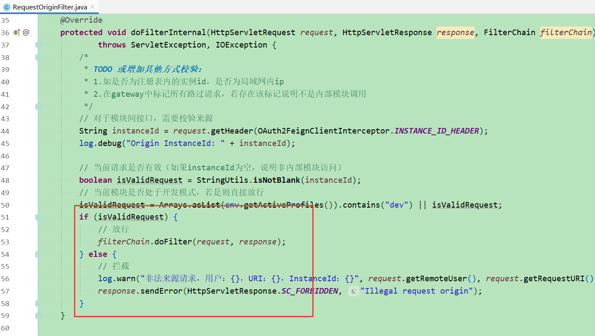

# jhipster-microservice-common
用于Jhipster创建的微服务应用的公用common组件。  

## 用途
用于Jhipster创建的微服务应用的公用common组件，简化模块间接口调用流程。  
1. 将feign接口提取为公用，解决各模块间接口的使用及维护问题。
2. 将@AuthorizedFeignClient和@AuthorizedUserFeignClient注解合并为@AuthorizedFeignClient，不再区分不同认证方式下的接口调用问题。  

## 使用说明
1. 项目结构  

2. 使用方式  
在引入common包之后，当前模块能扫描到该common后即可使用。
参考测试类中的示例demo，和一般原生Fegin注解使用方式无异。

## 实现原理
### 认证凭据传递
UAA认证方式主要有两种：用户调用、机器调用
1. 用户调用  
用户自身登录，调用权限接口。

1. 机器调用
模块自身登录，调用公共接口。一般用于定时作业，无用户的情况。

简单来说就是用用户的身份或模块的身份去登录，在跨模块调用时需要传递对应的认证信息token到目标模块中。  
在此common中对应以下代码：

### 内部调用校验
由于内部接口属于模块间调用，非前端等客户端对外接口，出于安全考虑需要有不同的访问限制。  
比如区分此请求是否由外部直接发起，还是由内部模块发起。   
主要思路有两种：
1. 是请求消费方标记自身实例来源，服务方校验其实例来源是否有效。  
消费方和服务方都引入common模块，common对其进行标记及校验。

2. 由于外部请求统一入口为Gateway，可以在Gateway处统一标记，未标记的默认为内部请求，然后由消费方的common校验是否来源于外部。  
此方式相对于上一种更加简单可靠，在无特殊需求的情况下基本是首选方案。   
  

以上两种方式仅作参考，其它方式如校验请求来源ip是否为局域网等，也可以尝试，视具体需求而定。

## 注意事项
此项目主要是提供个思路供参考，若实际使用还需在其中加入对应的业务feign接口。

